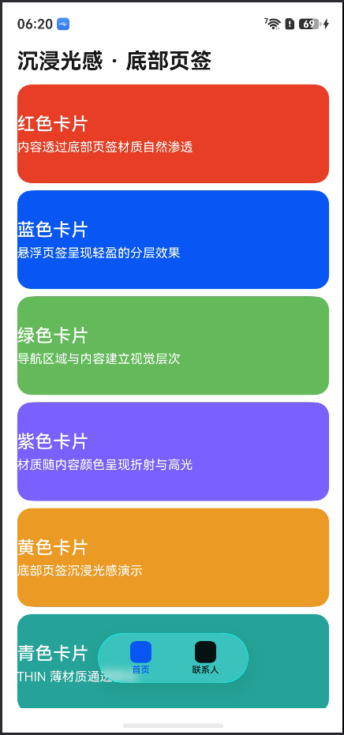
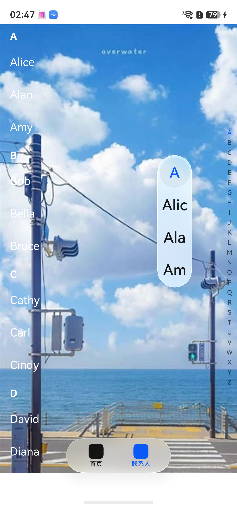
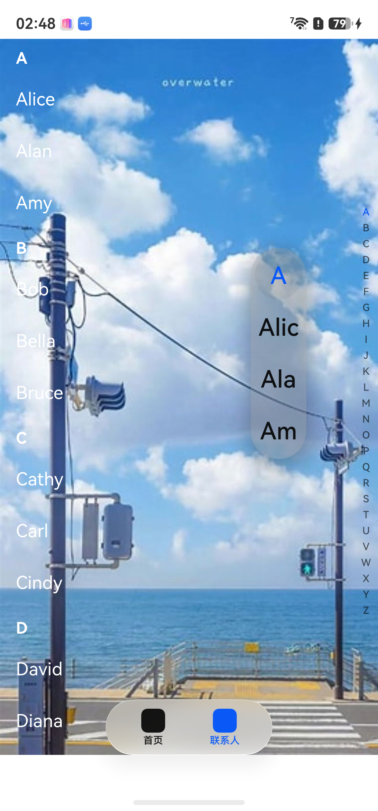
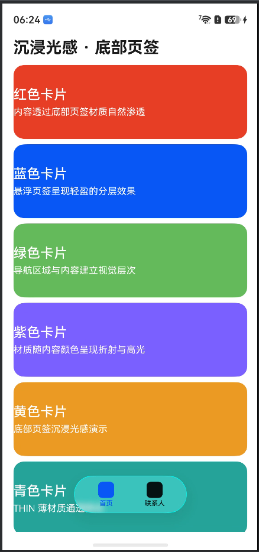
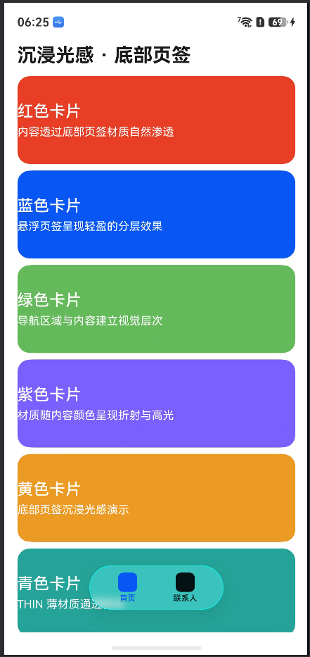

# Demo 真机验证记录

## 1. 验证说明

- **验证目标**：逐项核对根据官方文档生成的 Demo，其代码实现与真机表现是否符合对应开发指南。
- **验证依据**：各工程生成代码时使用的官网冻结快照与判据文件；若改用新版文档，另行记录版本及对应代码。
- **结论范围**：仅覆盖本文记录的文档版本、代码版本、设备和验证点。
- **填写方式**：验证点为待核对清单，按实际判据补充或拆分；对比实验合并为一条验证点，在同一条内记录各配置的结果。
- **历史报告**：原自动验证结果按实际覆盖范围引用；模拟器截图不作为本次真机视觉通过证据。

| 状态 | 含义 |
|---|---|
| 待验证 | 尚未执行 |
| 通过 | 实际结果符合文档预期，且有对应证据 |
| 不通过 | 满足验证前提，但实际结果与预期不一致 |
| 无法判定 | 设备能力、环境或证据不足 |
| 不适用 | 不适用于当前场景，需注明原因 |

实现符合性填写“符合 / 不符合 / 无法判定 / 待核对”；真机效果逐项使用上述验证状态。疑似文档问题需记录具体条目和证据，不由单次效果异常直接判定。

## 2. 验证总览

| 编号 | 工程目录 | Demo 名称 | 已通过 / 适用验证点数 | 实现符合性 | 真机效果一致性 | 明细 |
|---|---|---|---|---|---|---|
| D01 | `1/` | 底部页签与索引条沉浸光感 | 1 / 4（2 项不通过、1 项无法判定） | 当前核心配置符合，变体待核对 | 默认参数与 THIN 存在差异；索引条显式 THIN 无效果 | [详情](#d01) |
| D02 | `2/` | 弹窗类组件沉浸光感 | 待统计 | 待核对 | 待验证 | [详情](#d02) |
| D03 | `3/` | 按钮与选择类组件沉浸光感 | 待统计 | 待核对 | 待验证 | [详情](#d03) |
| D04 | `4/` | Button 沉浸光感生效区域 | 待统计 | 待核对 | 待验证 | [详情](#d04) |
| D05 | `6/` | 搜索框与内容区标题栏沉浸光感 | 待统计 | 待核对 | 待验证 | [详情](#d05) |
| D06 | `7/` | FAQ 材质遮挡解决方案 | 待统计 | 待核对 | 待验证 | [详情](#d06) |
| D07 | `8/ImmersiveLightDemo/` | HDS 标题栏与底部页签沉浸光感 | 待统计 | 待核对 | 待验证 | [详情](#d07) |
| D08 | `Express/` | Express 标题栏与导航 Tab 沉浸光感 | 待统计 | 待核对 | 待验证 | [详情](#d08) |
| D09 | `BookRead/` | BookRead HDS 沉浸光感 | 待统计 | 待核对 | 待验证 | [详情](#d09) |
| D10 | `Express2/` | Express 材质反色、赋色、交互与阴影 | 待统计 | 待核对 | 待验证 | [详情](#d10) |

## 3. 真机验证环境

同一环境可被多个 Demo 引用；设备、系统或关键设置变化时新增环境记录。SDK / HDS 版本存在工程差异时，在对应 Demo 基本信息中补充。

| 环境编号 | 真机型号 | HarmonyOS 完整版本 | SDK / API 版本 | HDS 版本（如适用） | 材质能力检测方式及结果 | 主题、字体及显示缩放等设置 |
|---|---|---|---|---|---|---|
| ENV-01 | 待填写 | 待填写 | 待填写 | 待填写 | 待填写 | 待填写 |

## 4. Demo 验证明细

<a id="d01"></a>

### D01 底部页签与索引条沉浸光感

#### 基本信息

| 项目 | 内容 |
|---|---|
| Demo 介绍 | 展示底部页签与索引条相关沉浸光感效果。本次重点验证底部页签材质、应用级开关影响，以及默认参数与显式材质样式的差异。 |
| 工程目录 | `1/` |
| 页面入口与操作路径 | 启动应用进入“首页”；滚动彩色卡片列表，观察底部悬浮页签；点击“联系人”进入索引条页面。 |
| 验证环境 | HUAWEI Mate XT 2 |
| 工程 SDK / API / HDS 版本 | 当前工程 targetSdkVersion、compatibleSdkVersion 均为 26.0.0；本实验使用 ArkUI |
| 本次验证范围 | 底部页签材质；索引提示弹窗及背景模糊对比（全局 ENABLE）；底部页签全局 DISABLE / ENABLE / DEFAULT 对比；默认参数 / ULTRA_THIN / THIN 对比 |

#### 验证点

**D01-01：底部页签材质效果**

验证操作：使 barFloatingStyle 悬浮样式生效，观察彩色内容上方的页签。

文档预期：根据[组件适配沉浸光感：底部页签（Tabs）](https://developer.huawei.com/consumer/cn/doc/harmonyos-guides/arkts-immersive-light-sense-component-adaptation)，可通过 [barFloatingStyle](https://developer.huawei.com/consumer/cn/doc/harmonyos-references/ts-container-tabs#barfloatingstyle) 中的 FloatingTabBarStyle.systemMaterial 设置底部页签材质。悬浮样式需同时满足 barOverlap=true、vertical=false、barPosition=BarPosition.End，生效后可呈现沉浸光感。

真机结果：底部页签能实现沉浸光感，呈现通透背板及悬浮效果。

验证状态：**通过**。



**D01-02：索引提示弹窗 systemMaterial THIN / 背景模糊对比**

验证操作：全局沉浸光感开关设为 ENABLE，进入联系人页并触发索引提示弹窗。第一组显式配置 `.systemMaterial(new uiMaterial.ImmersiveMaterial({ style: uiMaterial.ImmersiveStyle.THIN }))`；第二组配置 `.popupBackgroundBlurStyle(BlurStyle.BACKGROUND_THIN)`，对比两组效果。

文档预期：根据[组件适配沉浸光感：索引条（AlphabetIndexer）](https://developer.huawei.com/consumer/cn/doc/harmonyos-guides/arkts-immersive-light-sense-component-adaptation)，应用级开关为 ENABLE 时，索引条默认开启沉浸光感，默认材质为 THICK；也可通过 systemMaterial 主动设置沉浸光感效果。popupBackground、popupBackgroundBlurStyle 与沉浸光感互斥，主动设置后不再显示沉浸光感效果。

真机结果：第一张图显式设置 systemMaterial 为 THIN，但实测没有沉浸光感效果，仅显示浅色提示弹窗背板；第二张图设置 popupBackgroundBlurStyle 为 BACKGROUND_THIN 后，实测有效果，弹窗周围的明暗过渡更明显。两组测试的全局开关均已开启。

验证状态：**不通过（按实测记录，systemMaterial THIN 未呈现预期效果）**。第二组有效果，但背景模糊本身也会产生视觉变化，是否属于沉浸光感仍需区分；该现象记录为疑似文档或实现差异。

| systemMaterial：THIN，全局 ENABLE，无效果 | popupBackgroundBlurStyle：BACKGROUND_THIN，全局 ENABLE，有效果 |
| :---: | :---: |
|  |  |

**D01-03：全局 DISABLE / ENABLE / DEFAULT 对比**

验证操作：保持底部页签配置不变，分别将应用级沉浸光感配置设为 DISABLE、ENABLE、DEFAULT，观察底部页签效果。

文档预期：[组件适配沉浸光感：底部页签（Tabs）](https://developer.huawei.com/consumer/cn/doc/harmonyos-guides/arkts-immersive-light-sense-component-adaptation)说明，[应用级开关 MaterialState](https://developer.huawei.com/consumer/cn/doc/harmonyos-references/arkts-apis-uimaterial#materialstate) 为 ENABLE 时，底部页签不会仅因此默认开启沉浸光感；设置 [barFloatingStyle](https://developer.huawei.com/consumer/cn/doc/harmonyos-references/ts-container-tabs#barfloatingstyle) 且悬浮样式生效时，底部页签默认开启沉浸光感。该段未单独说明本次组件配置下 DISABLE、DEFAULT 的覆盖关系，需结合组件级配置核对。

真机结果：三种已测取值下沉浸光感均开启，效果基本一致。本次实测认为底部页签的沉浸光感开启由 barFloatingStyle 配置决定。

验证状态：**无法判定（对比已完成，整体规范符合性待核对）**。其中 ENABLE 下的开启效果符合预期，DISABLE、DEFAULT 的配置覆盖关系待核对。

| E01：DISABLE | E02：ENABLE | E03：DEFAULT |
| :---: | :---: | :---: |
|  |  |  |

**D01-04：默认参数 / THIN / ULTRA_THIN 对比**

验证操作：分别使用 barFloatingStyle 默认参数、显式 THIN、显式 ULTRA_THIN，观察青色与橙色内容交界处的材质效果。

文档预期：[组件适配沉浸光感：底部页签（Tabs）](https://developer.huawei.com/consumer/cn/doc/harmonyos-guides/arkts-immersive-light-sense-component-adaptation)明确说明，设置 [barFloatingStyle](https://developer.huawei.com/consumer/cn/doc/harmonyos-references/ts-container-tabs#barfloatingstyle) 且悬浮样式生效后，沉浸式系统材质样式默认取值为 THIN。因此默认效果应与同条件下显式 THIN 一致；通过 FloatingTabBarStyle.systemMaterial 显式设置时，按指定材质样式呈现效果。

真机结果：默认参数效果与显式 THIN 不一致；THIN 与 ULTRA_THIN 均有材质效果，外观存在差异。

验证状态：**不通过（默认效果与 THIN 不一致，疑似文档问题）**。

| E04：默认参数 | E05：THIN | E06：ULTRA_THIN |
| :---: | :---: | :---: |
|  |  |  |

#### 符合性结论

| 结论项 | 结果 | 依据 / 说明 |
|---|---|---|
| 代码实现是否符合开发指南 | 当前代码的底部页签核心配置符合；各实测变体待补充核对 | [Index.ets](1/entry/src/main/ets/pages/Index.ets) 使用 BarPosition.End、barOverlap(true)、barFloatingStyle.systemMaterial 显式 THIN；vertical 未设置，沿用默认值。当前代码不能代表所有截图对应变体。 |
| 底部页签能否实现沉浸光感 | 通过 | 用户实测与 E01–E03 支持底部页签材质生效。 |
| 全局开关影响 | 三种已测取值效果基本一致且均开启 | 用户实测认为本场景由 barFloatingStyle 配置决定开启。结论限于本次 DISABLE、ENABLE、DEFAULT 及已测组件配置，不扩展到所有参数组合。 |
| 索引提示弹窗是否符合文档 | 不通过，存在疑似差异 | 全局 ENABLE 下，显式 systemMaterial THIN 实测无效果，BACKGROUND_THIN 背景模糊配置实测有效果；后者是否属于沉浸光感需区分。 |
| 默认材质是否符合文档 | 不通过，存在疑似冲突 | 用户实测默认参数效果与显式 THIN 不一致，与“默认取值为 THIN”的描述存在差异。 |
| 未覆盖项及结论限制 | 待补充 | 完整系统版本、各配置代码及安装包标识未提供；默认参数对比截图的裁剪与背景相对位置存在差异。未设置 barFloatingStyle 的对照结果尚未提供。 |

<a id="d02"></a>

### D02 弹窗类组件沉浸光感

#### 基本信息

| 项目 | 内容 |
|---|---|
| Demo 介绍 | 验证即时反馈、气泡提示、菜单与弹出框的沉浸光感，以及应用级开关对效果的影响。 |
| 工程目录 | `2/` |
| 页面入口与操作路径 | 待填写 |
| 代码版本 / 安装包标识 | 待填写提交号、代码快照或 HAP 哈希 |
| 验证环境 | 待填写环境编号 |
| 工程 SDK / API / HDS 版本 | 待填写 |
| 验证日期 / 验证人 | 待填写 |
| 本次验证范围 | 待填写 |
| 现有自动验证报告 | [开发验证报告](2/ohos-feature-engineering/development-verification-report.md) |
| 现有报告结果及覆盖层级 | 待核对填写 |

#### 官方依据

| 依据编号 | 官方文档链接及章节 | 本地冻结快照 | 冻结时间 / 适用版本 | 判据 ID | 文档要求与适用前提 |
|---|---|---|---|---|---|
| D02-REF-01 | 待填写 | 待填写快照路径及行号 | 待填写 | 待填写实际判据 ID | 待填写 |

#### 验证点

| 验证点 ID | 验证内容 | 官方依据 | 前置条件 / 配置 | 操作步骤 | 文档预期 | 真机实际结果 | 状态 | 证据编号 |
|---|---|---|---|---|---|---|---|---|
| D02-01 | 即时反馈材质效果 | 待补充 | 待填写 | 待填写 | 按判据填写 | 待实测 | 待验证 | 待补充 |
| D02-02 | 气泡提示材质效果 | 待补充 | 待填写 | 待填写 | 按判据填写 | 待实测 | 待验证 | 待补充 |
| D02-03 | 菜单材质效果 | 待补充 | 待填写 | 待填写 | 按判据填写 | 待实测 | 待验证 | 待补充 |
| D02-04 | 弹出框材质效果 | 待补充 | 待填写 | 待填写 | 按判据填写 | 待实测 | 待验证 | 待补充 |
| D02-05 | 应用级开关不同取值下的效果对比 | 待补充 | 待填写 | 待填写 | 按判据填写 | 待实测 | 待验证 | 待补充 |

#### 真机截图与录屏

**D02-E01**

- 关联验证点：待填写
- 环境编号：待填写
- 页面状态、开关名称及具体配置：待填写
- 观察位置：待填写
- 实际观察：待填写
- 真机截图：待采集
- 录屏（动态效果适用）：待采集 / 不适用

**D02-E02：对照证据（如适用）**

- 关联验证点：待填写
- 环境编号：待填写
- 配置 A：待填写
- 配置 B：待填写
- 相同条件（页面、背景、操作等）：待填写
- 对比截图 / 录屏：待采集
- 实际差异：待填写

#### 符合性结论

| 结论项 | 结果 | 依据 / 说明 |
|---|---|---|
| 代码实现是否符合开发指南 | 待核对 | 待填写代码位置与判据 |
| 真机效果是否符合文档预期 | 待验证 | 待填写验证点及证据编号 |
| 是否发现疑似文档问题 | 待判定 | 待填写具体文档条目与差异 |
| 未覆盖项及结论限制 | 待填写 | 待填写未执行的配置、设备或场景 |

#### 异常记录

无异常时填写“无”；多项异常分别记录。

- 关联验证点：待填写
- 文档预期：待填写
- 实际表现：待填写
- 最小复现步骤：待填写
- 前置条件满足情况：待填写
- 代码、设备与日志证据：待填写
- 初步归因：待判定（实现问题 / 环境问题 / 疑似文档问题 / 尚未定位）
- 待核实事项：待填写

<a id="d03"></a>

### D03 按钮与选择类组件沉浸光感

#### 基本信息

| 项目 | 内容 |
|---|---|
| Demo 介绍 | 验证按钮、下拉按钮、开关、滑动条、子页签与操作块的沉浸光感。 |
| 工程目录 | `3/` |
| 页面入口与操作路径 | 待填写 |
| 代码版本 / 安装包标识 | 待填写提交号、代码快照或 HAP 哈希 |
| 验证环境 | 待填写环境编号 |
| 工程 SDK / API / HDS 版本 | 待填写 |
| 验证日期 / 验证人 | 待填写 |
| 本次验证范围 | 待填写 |
| 现有自动验证报告 | [开发验证报告](3/ohos-feature-engineering/development-verification-report.md) |
| 现有报告结果及覆盖层级 | 待核对填写 |

#### 官方依据

| 依据编号 | 官方文档链接及章节 | 本地冻结快照 | 冻结时间 / 适用版本 | 判据 ID | 文档要求与适用前提 |
|---|---|---|---|---|---|
| D03-REF-01 | 待填写 | 待填写快照路径及行号 | 待填写 | 待填写实际判据 ID | 待填写 |

#### 验证点

| 验证点 ID | 验证内容 | 官方依据 | 前置条件 / 配置 | 操作步骤 | 文档预期 | 真机实际结果 | 状态 | 证据编号 |
|---|---|---|---|---|---|---|---|---|
| D03-01 | 按钮材质效果 | 待补充 | 待填写 | 待填写 | 按判据填写 | 待实测 | 待验证 | 待补充 |
| D03-02 | 下拉按钮材质效果 | 待补充 | 待填写 | 待填写 | 按判据填写 | 待实测 | 待验证 | 待补充 |
| D03-03 | 开关材质效果 | 待补充 | 待填写 | 待填写 | 按判据填写 | 待实测 | 待验证 | 待补充 |
| D03-04 | 滑动条材质效果 | 待补充 | 待填写 | 待填写 | 按判据填写 | 待实测 | 待验证 | 待补充 |
| D03-05 | 子页签材质效果 | 待补充 | 待填写 | 待填写 | 按判据填写 | 待实测 | 待验证 | 待补充 |
| D03-06 | 操作块材质效果 | 待补充 | 待填写 | 待填写 | 按判据填写 | 待实测 | 待验证 | 待补充 |

#### 真机截图与录屏

**D03-E01**

- 关联验证点：待填写
- 环境编号：待填写
- 页面状态、开关名称及具体配置：待填写
- 观察位置：待填写
- 实际观察：待填写
- 真机截图：待采集
- 录屏（动态效果适用）：待采集 / 不适用

**D03-E02：对照证据（如适用）**

- 关联验证点：待填写
- 环境编号：待填写
- 配置 A：待填写
- 配置 B：待填写
- 相同条件（页面、背景、操作等）：待填写
- 对比截图 / 录屏：待采集
- 实际差异：待填写

#### 符合性结论

| 结论项 | 结果 | 依据 / 说明 |
|---|---|---|
| 代码实现是否符合开发指南 | 待核对 | 待填写代码位置与判据 |
| 真机效果是否符合文档预期 | 待验证 | 待填写验证点及证据编号 |
| 是否发现疑似文档问题 | 待判定 | 待填写具体文档条目与差异 |
| 未覆盖项及结论限制 | 待填写 | 待填写未执行的配置、设备或场景 |

#### 异常记录

无异常时填写“无”；多项异常分别记录。

- 关联验证点：待填写
- 文档预期：待填写
- 实际表现：待填写
- 最小复现步骤：待填写
- 前置条件满足情况：待填写
- 代码、设备与日志证据：待填写
- 初步归因：待判定（实现问题 / 环境问题 / 疑似文档问题 / 尚未定位）
- 待核实事项：待填写

<a id="d04"></a>

### D04 Button 沉浸光感生效区域

#### 基本信息

| 项目 | 内容 |
|---|---|
| Demo 介绍 | 验证 Button 沉浸光感的生效区域及文档所述限制。 |
| 工程目录 | `4/` |
| 页面入口与操作路径 | 待填写 |
| 代码版本 / 安装包标识 | 待填写提交号、代码快照或 HAP 哈希 |
| 验证环境 | 待填写环境编号 |
| 工程 SDK / API / HDS 版本 | 待填写 |
| 验证日期 / 验证人 | 待填写 |
| 本次验证范围 | 待填写 |
| 现有自动验证报告 | [开发验证报告](4/ohos-feature-engineering/development-verification-report.md) |
| 现有报告结果及覆盖层级 | 待核对填写 |

#### 官方依据

| 依据编号 | 官方文档链接及章节 | 本地冻结快照 | 冻结时间 / 适用版本 | 判据 ID | 文档要求与适用前提 |
|---|---|---|---|---|---|
| D04-REF-01 | 待填写 | 待填写快照路径及行号 | 待填写 | 待填写实际判据 ID | 待填写 |

#### 验证点

| 验证点 ID | 验证内容 | 官方依据 | 前置条件 / 配置 | 操作步骤 | 文档预期 | 真机实际结果 | 状态 | 证据编号 |
|---|---|---|---|---|---|---|---|---|
| D04-01 | 文档所述生效区域内的表现 | 待补充 | 待填写 | 待填写 | 按判据填写 | 待实测 | 待验证 | 待补充 |
| D04-02 | 文档所述生效区域外的表现 | 待补充 | 待填写 | 待填写 | 按判据填写 | 待实测 | 待验证 | 待补充 |
| D04-03 | 适用前提与边界条件 | 待补充 | 待填写 | 待填写 | 按判据填写 | 待实测 | 待验证 | 待补充 |

#### 真机截图与录屏

**D04-E01**

- 关联验证点：待填写
- 环境编号：待填写
- 页面状态、开关名称及具体配置：待填写
- 观察位置：待填写
- 实际观察：待填写
- 真机截图：待采集
- 录屏（动态效果适用）：待采集 / 不适用

**D04-E02：对照证据（如适用）**

- 关联验证点：待填写
- 环境编号：待填写
- 配置 A：待填写
- 配置 B：待填写
- 相同条件（页面、背景、操作等）：待填写
- 对比截图 / 录屏：待采集
- 实际差异：待填写

#### 符合性结论

| 结论项 | 结果 | 依据 / 说明 |
|---|---|---|
| 代码实现是否符合开发指南 | 待核对 | 待填写代码位置与判据 |
| 真机效果是否符合文档预期 | 待验证 | 待填写验证点及证据编号 |
| 是否发现疑似文档问题 | 待判定 | 待填写具体文档条目与差异 |
| 未覆盖项及结论限制 | 待填写 | 待填写未执行的配置、设备或场景 |

#### 异常记录

无异常时填写“无”；多项异常分别记录。

- 关联验证点：待填写
- 文档预期：待填写
- 实际表现：待填写
- 最小复现步骤：待填写
- 前置条件满足情况：待填写
- 代码、设备与日志证据：待填写
- 初步归因：待判定（实现问题 / 环境问题 / 疑似文档问题 / 尚未定位）
- 待核实事项：待填写

<a id="d05"></a>

### D05 搜索框与内容区标题栏沉浸光感

#### 基本信息

| 项目 | 内容 |
|---|---|
| Demo 介绍 | 在两个页面分别验证搜索框标题栏与内容区标题栏的沉浸光感。 |
| 工程目录 | `6/` |
| 页面入口与操作路径 | 待填写 |
| 代码版本 / 安装包标识 | 待填写提交号、代码快照或 HAP 哈希 |
| 验证环境 | 待填写环境编号 |
| 工程 SDK / API / HDS 版本 | 待填写 |
| 验证日期 / 验证人 | 待填写 |
| 本次验证范围 | 待填写 |
| 现有自动验证报告 | [开发验证报告](6/ohos-feature-engineering/development-verification-report.md) |
| 现有报告结果及覆盖层级 | 待核对填写 |

#### 官方依据

| 依据编号 | 官方文档链接及章节 | 本地冻结快照 | 冻结时间 / 适用版本 | 判据 ID | 文档要求与适用前提 |
|---|---|---|---|---|---|
| D05-REF-01 | 待填写 | 待填写快照路径及行号 | 待填写 | 待填写实际判据 ID | 待填写 |

#### 验证点

| 验证点 ID | 验证内容 | 官方依据 | 前置条件 / 配置 | 操作步骤 | 文档预期 | 真机实际结果 | 状态 | 证据编号 |
|---|---|---|---|---|---|---|---|---|
| D05-01 | 搜索框标题栏材质效果 | 待补充 | 待填写 | 待填写 | 按判据填写 | 待实测 | 待验证 | 待补充 |
| D05-02 | 内容区标题栏材质效果 | 待补充 | 待填写 | 待填写 | 按判据填写 | 待实测 | 待验证 | 待补充 |

#### 真机截图与录屏

**D05-E01**

- 关联验证点：待填写
- 环境编号：待填写
- 页面状态、开关名称及具体配置：待填写
- 观察位置：待填写
- 实际观察：待填写
- 真机截图：待采集
- 录屏（动态效果适用）：待采集 / 不适用

**D05-E02：对照证据（如适用）**

- 关联验证点：待填写
- 环境编号：待填写
- 配置 A：待填写
- 配置 B：待填写
- 相同条件（页面、背景、操作等）：待填写
- 对比截图 / 录屏：待采集
- 实际差异：待填写

#### 符合性结论

| 结论项 | 结果 | 依据 / 说明 |
|---|---|---|
| 代码实现是否符合开发指南 | 待核对 | 待填写代码位置与判据 |
| 真机效果是否符合文档预期 | 待验证 | 待填写验证点及证据编号 |
| 是否发现疑似文档问题 | 待判定 | 待填写具体文档条目与差异 |
| 未覆盖项及结论限制 | 待填写 | 待填写未执行的配置、设备或场景 |

#### 异常记录

无异常时填写“无”；多项异常分别记录。

- 关联验证点：待填写
- 文档预期：待填写
- 实际表现：待填写
- 最小复现步骤：待填写
- 前置条件满足情况：待填写
- 代码、设备与日志证据：待填写
- 初步归因：待判定（实现问题 / 环境问题 / 疑似文档问题 / 尚未定位）
- 待核实事项：待填写

<a id="d06"></a>

### D06 FAQ 材质遮挡解决方案

#### 基本信息

| 项目 | 内容 |
|---|---|
| Demo 介绍 | 复现背景色、背景模糊和不透明材质赋色相关问题，核对 FAQ 解决方案的实际效果。 |
| 工程目录 | `7/` |
| 页面入口与操作路径 | 待填写 |
| 代码版本 / 安装包标识 | 待填写提交号、代码快照或 HAP 哈希 |
| 验证环境 | 待填写环境编号 |
| 工程 SDK / API / HDS 版本 | 待填写 |
| 验证日期 / 验证人 | 待填写 |
| 本次验证范围 | 待填写 |
| 现有自动验证报告 | [开发验证报告](7/ohos-feature-engineering/development-verification-report.md) |
| 现有报告结果及覆盖层级 | 待核对填写 |

#### 官方依据

| 依据编号 | 官方文档链接及章节 | 本地冻结快照 | 冻结时间 / 适用版本 | 判据 ID | 文档要求与适用前提 |
|---|---|---|---|---|---|
| D06-REF-01 | 待填写 | 待填写快照路径及行号 | 待填写 | 待填写实际判据 ID | 待填写 |

#### 验证点

| 验证点 ID | 验证内容 | 官方依据 | 前置条件 / 配置 | 操作步骤 | 文档预期 | 真机实际结果 | 状态 | 证据编号 |
|---|---|---|---|---|---|---|---|---|
| D06-01 | 背景色遮挡：问题复现与方案验证 | 待补充 | 待填写 | 待填写 | 按判据填写 | 待实测 | 待验证 | 待补充 |
| D06-02 | 背景模糊遮挡：问题复现与方案验证 | 待补充 | 待填写 | 待填写 | 按判据填写 | 待实测 | 待验证 | 待补充 |
| D06-03 | materialColor 不透明颜色：问题复现与方案验证 | 待补充 | 待填写 | 待填写 | 按判据填写 | 待实测 | 待验证 | 待补充 |

#### 真机截图与录屏

**D06-E01**

- 关联验证点：待填写
- 环境编号：待填写
- 页面状态、开关名称及具体配置：待填写
- 观察位置：待填写
- 实际观察：待填写
- 真机截图：待采集
- 录屏（动态效果适用）：待采集 / 不适用

**D06-E02：对照证据（如适用）**

- 关联验证点：待填写
- 环境编号：待填写
- 配置 A：待填写
- 配置 B：待填写
- 相同条件（页面、背景、操作等）：待填写
- 对比截图 / 录屏：待采集
- 实际差异：待填写

#### 符合性结论

| 结论项 | 结果 | 依据 / 说明 |
|---|---|---|
| 代码实现是否符合开发指南 | 待核对 | 待填写代码位置与判据 |
| 真机效果是否符合文档预期 | 待验证 | 待填写验证点及证据编号 |
| 是否发现疑似文档问题 | 待判定 | 待填写具体文档条目与差异 |
| 未覆盖项及结论限制 | 待填写 | 待填写未执行的配置、设备或场景 |

#### 异常记录

无异常时填写“无”；多项异常分别记录。

- 关联验证点：待填写
- 文档预期：待填写
- 实际表现：待填写
- 最小复现步骤：待填写
- 前置条件满足情况：待填写
- 代码、设备与日志证据：待填写
- 初步归因：待判定（实现问题 / 环境问题 / 疑似文档问题 / 尚未定位）
- 待核实事项：待填写

<a id="d07"></a>

### D07 HDS 标题栏与底部页签沉浸光感

#### 基本信息

| 项目 | 内容 |
|---|---|
| Demo 介绍 | 验证 HDS 标题栏与底部页签的沉浸光感。 |
| 工程目录 | `8/ImmersiveLightDemo/` |
| 页面入口与操作路径 | 待填写 |
| 代码版本 / 安装包标识 | 待填写提交号、代码快照或 HAP 哈希 |
| 验证环境 | 待填写环境编号 |
| 工程 SDK / API / HDS 版本 | 待填写 |
| 验证日期 / 验证人 | 待填写 |
| 本次验证范围 | 待填写 |
| 现有自动验证报告 | [开发验证报告](8/ImmersiveLightDemo/ohos-feature-engineering/development-verification-report.md) |
| 现有报告结果及覆盖层级 | 待核对填写 |

#### 官方依据

| 依据编号 | 官方文档链接及章节 | 本地冻结快照 | 冻结时间 / 适用版本 | 判据 ID | 文档要求与适用前提 |
|---|---|---|---|---|---|
| D07-REF-01 | 待填写 | 待填写快照路径及行号 | 待填写 | 待填写实际判据 ID | 待填写 |

#### 验证点

| 验证点 ID | 验证内容 | 官方依据 | 前置条件 / 配置 | 操作步骤 | 文档预期 | 真机实际结果 | 状态 | 证据编号 |
|---|---|---|---|---|---|---|---|---|
| D07-01 | HDS 标题栏材质效果 | 待补充 | 待填写 | 待填写 | 按判据填写 | 待实测 | 待验证 | 待补充 |
| D07-02 | HDS 底部页签材质效果 | 待补充 | 待填写 | 待填写 | 按判据填写 | 待实测 | 待验证 | 待补充 |

#### 真机截图与录屏

**D07-E01**

- 关联验证点：待填写
- 环境编号：待填写
- 页面状态、开关名称及具体配置：待填写
- 观察位置：待填写
- 实际观察：待填写
- 真机截图：待采集
- 录屏（动态效果适用）：待采集 / 不适用

**D07-E02：对照证据（如适用）**

- 关联验证点：待填写
- 环境编号：待填写
- 配置 A：待填写
- 配置 B：待填写
- 相同条件（页面、背景、操作等）：待填写
- 对比截图 / 录屏：待采集
- 实际差异：待填写

#### 符合性结论

| 结论项 | 结果 | 依据 / 说明 |
|---|---|---|
| 代码实现是否符合开发指南 | 待核对 | 待填写代码位置与判据 |
| 真机效果是否符合文档预期 | 待验证 | 待填写验证点及证据编号 |
| 是否发现疑似文档问题 | 待判定 | 待填写具体文档条目与差异 |
| 未覆盖项及结论限制 | 待填写 | 待填写未执行的配置、设备或场景 |

#### 异常记录

无异常时填写“无”；多项异常分别记录。

- 关联验证点：待填写
- 文档预期：待填写
- 实际表现：待填写
- 最小复现步骤：待填写
- 前置条件满足情况：待填写
- 代码、设备与日志证据：待填写
- 初步归因：待判定（实现问题 / 环境问题 / 疑似文档问题 / 尚未定位）
- 待核实事项：待填写

<a id="d08"></a>

### D08 Express 标题栏与导航 Tab 沉浸光感

#### 基本信息

| 项目 | 内容 |
|---|---|
| Demo 介绍 | 验证既有 Express 工程标题栏与导航 Tab 的沉浸光感。 |
| 工程目录 | `Express/` |
| 页面入口与操作路径 | 待填写 |
| 代码版本 / 安装包标识 | 待填写提交号、代码快照或 HAP 哈希 |
| 验证环境 | 待填写环境编号 |
| 工程 SDK / API / HDS 版本 | 待填写 |
| 验证日期 / 验证人 | 待填写 |
| 本次验证范围 | 待填写 |
| 现有自动验证报告 | [开发验证报告](Express/ohos-feature-engineering/development-verification-report.md) |
| 现有报告结果及覆盖层级 | 待核对填写 |

#### 官方依据

| 依据编号 | 官方文档链接及章节 | 本地冻结快照 | 冻结时间 / 适用版本 | 判据 ID | 文档要求与适用前提 |
|---|---|---|---|---|---|
| D08-REF-01 | 待填写 | 待填写快照路径及行号 | 待填写 | 待填写实际判据 ID | 待填写 |

#### 验证点

| 验证点 ID | 验证内容 | 官方依据 | 前置条件 / 配置 | 操作步骤 | 文档预期 | 真机实际结果 | 状态 | 证据编号 |
|---|---|---|---|---|---|---|---|---|
| D08-01 | 标题栏材质效果 | 待补充 | 待填写 | 待填写 | 按判据填写 | 待实测 | 待验证 | 待补充 |
| D08-02 | 导航 Tab 材质效果 | 待补充 | 待填写 | 待填写 | 按判据填写 | 待实测 | 待验证 | 待补充 |

#### 真机截图与录屏

**D08-E01**

- 关联验证点：待填写
- 环境编号：待填写
- 页面状态、开关名称及具体配置：待填写
- 观察位置：待填写
- 实际观察：待填写
- 真机截图：待采集
- 录屏（动态效果适用）：待采集 / 不适用

**D08-E02：对照证据（如适用）**

- 关联验证点：待填写
- 环境编号：待填写
- 配置 A：待填写
- 配置 B：待填写
- 相同条件（页面、背景、操作等）：待填写
- 对比截图 / 录屏：待采集
- 实际差异：待填写

#### 符合性结论

| 结论项 | 结果 | 依据 / 说明 |
|---|---|---|
| 代码实现是否符合开发指南 | 待核对 | 待填写代码位置与判据 |
| 真机效果是否符合文档预期 | 待验证 | 待填写验证点及证据编号 |
| 是否发现疑似文档问题 | 待判定 | 待填写具体文档条目与差异 |
| 未覆盖项及结论限制 | 待填写 | 待填写未执行的配置、设备或场景 |

#### 异常记录

无异常时填写“无”；多项异常分别记录。

- 关联验证点：待填写
- 文档预期：待填写
- 实际表现：待填写
- 最小复现步骤：待填写
- 前置条件满足情况：待填写
- 代码、设备与日志证据：待填写
- 初步归因：待判定（实现问题 / 环境问题 / 疑似文档问题 / 尚未定位）
- 待核实事项：待填写

<a id="d09"></a>

### D09 BookRead HDS 沉浸光感

#### 基本信息

| 项目 | 内容 |
|---|---|
| Demo 介绍 | 验证既有 BookRead 工程接入 HDS 沉浸光感后的表现，具体组件范围按工程填写。 |
| 工程目录 | `BookRead/` |
| 页面入口与操作路径 | 待填写 |
| 代码版本 / 安装包标识 | 待填写提交号、代码快照或 HAP 哈希 |
| 验证环境 | 待填写环境编号 |
| 工程 SDK / API / HDS 版本 | 待填写 |
| 验证日期 / 验证人 | 待填写 |
| 本次验证范围 | 待填写 |
| 现有自动验证报告 | [开发验证报告](BookRead/ohos-feature-engineering/development-verification-report.md) |
| 现有报告结果及覆盖层级 | 待核对填写 |

#### 官方依据

| 依据编号 | 官方文档链接及章节 | 本地冻结快照 | 冻结时间 / 适用版本 | 判据 ID | 文档要求与适用前提 |
|---|---|---|---|---|---|
| D09-REF-01 | 待填写 | 待填写快照路径及行号 | 待填写 | 待填写实际判据 ID | 待填写 |

#### 验证点

| 验证点 ID | 验证内容 | 官方依据 | 前置条件 / 配置 | 操作步骤 | 文档预期 | 真机实际结果 | 状态 | 证据编号 |
|---|---|---|---|---|---|---|---|---|
| D09-01 | HDS 接入实现与适用条件 | 待补充 | 待填写 | 待填写 | 按判据填写 | 待实测 | 待验证 | 待补充 |
| D09-02 | 实际接入组件的材质效果（按组件拆行） | 待补充 | 待填写 | 待填写 | 按判据填写 | 待实测 | 待验证 | 待补充 |

#### 真机截图与录屏

**D09-E01**

- 关联验证点：待填写
- 环境编号：待填写
- 页面状态、开关名称及具体配置：待填写
- 观察位置：待填写
- 实际观察：待填写
- 真机截图：待采集
- 录屏（动态效果适用）：待采集 / 不适用

**D09-E02：对照证据（如适用）**

- 关联验证点：待填写
- 环境编号：待填写
- 配置 A：待填写
- 配置 B：待填写
- 相同条件（页面、背景、操作等）：待填写
- 对比截图 / 录屏：待采集
- 实际差异：待填写

#### 符合性结论

| 结论项 | 结果 | 依据 / 说明 |
|---|---|---|
| 代码实现是否符合开发指南 | 待核对 | 待填写代码位置与判据 |
| 真机效果是否符合文档预期 | 待验证 | 待填写验证点及证据编号 |
| 是否发现疑似文档问题 | 待判定 | 待填写具体文档条目与差异 |
| 未覆盖项及结论限制 | 待填写 | 待填写未执行的配置、设备或场景 |

#### 异常记录

无异常时填写“无”；多项异常分别记录。

- 关联验证点：待填写
- 文档预期：待填写
- 实际表现：待填写
- 最小复现步骤：待填写
- 前置条件满足情况：待填写
- 代码、设备与日志证据：待填写
- 初步归因：待判定（实现问题 / 环境问题 / 疑似文档问题 / 尚未定位）
- 待核实事项：待填写

<a id="d10"></a>

### D10 Express 材质反色、赋色、交互与阴影

#### 基本信息

| 项目 | 内容 |
|---|---|
| Demo 介绍 | 验证 Tab 自动反色、半透明红色赋色和材质交互，以及标题栏右侧圆形与沉浸材质阴影。 |
| 工程目录 | `Express2/` |
| 页面入口与操作路径 | 待填写 |
| 代码版本 / 安装包标识 | 待填写提交号、代码快照或 HAP 哈希 |
| 验证环境 | 待填写环境编号 |
| 工程 SDK / API / HDS 版本 | 待填写 |
| 验证日期 / 验证人 | 待填写 |
| 本次验证范围 | 待填写 |
| 现有自动验证报告 | [开发验证报告](Express2/ohos-feature-engineering/development-verification-report.md) |
| 现有报告结果及覆盖层级 | 待核对填写 |

#### 官方依据

| 依据编号 | 官方文档链接及章节 | 本地冻结快照 | 冻结时间 / 适用版本 | 判据 ID | 文档要求与适用前提 |
|---|---|---|---|---|---|
| D10-REF-01 | 待填写 | 待填写快照路径及行号 | 待填写 | 待填写实际判据 ID | 待填写 |

#### 验证点

| 验证点 ID | 验证内容 | 官方依据 | 前置条件 / 配置 | 操作步骤 | 文档预期 | 真机实际结果 | 状态 | 证据编号 |
|---|---|---|---|---|---|---|---|---|
| D10-01 | Tab 自动反色 | 待补充 | 待填写 | 待填写 | 按判据填写 | 待实测 | 待验证 | 待补充 |
| D10-02 | Tab 材质赋色 rgba(255, 0, 0, 0.2) | 待补充 | 待填写 | 待填写 | 按判据填写 | 待实测 | 待验证 | 待补充 |
| D10-03 | Tab 材质交互效果（按实际配置拆行） | 待补充 | 待填写 | 待填写 | 按判据填写 | 待实测 | 待验证 | 待补充 |
| D10-04 | 标题栏右侧圆形 | 待补充 | 待填写 | 待填写 | 按判据填写 | 待实测 | 待验证 | 待补充 |
| D10-05 | 沉浸材质阴影效果 | 待补充 | 待填写 | 待填写 | 按判据填写 | 待实测 | 待验证 | 待补充 |

#### 真机截图与录屏

**D10-E01**

- 关联验证点：待填写
- 环境编号：待填写
- 页面状态、开关名称及具体配置：待填写
- 观察位置：待填写
- 实际观察：待填写
- 真机截图：待采集
- 录屏（动态效果适用）：待采集 / 不适用

**D10-E02：对照证据（如适用）**

- 关联验证点：待填写
- 环境编号：待填写
- 配置 A：待填写
- 配置 B：待填写
- 相同条件（页面、背景、操作等）：待填写
- 对比截图 / 录屏：待采集
- 实际差异：待填写

#### 符合性结论

| 结论项 | 结果 | 依据 / 说明 |
|---|---|---|
| 代码实现是否符合开发指南 | 待核对 | 待填写代码位置与判据 |
| 真机效果是否符合文档预期 | 待验证 | 待填写验证点及证据编号 |
| 是否发现疑似文档问题 | 待判定 | 待填写具体文档条目与差异 |
| 未覆盖项及结论限制 | 待填写 | 待填写未执行的配置、设备或场景 |

#### 异常记录

无异常时填写“无”；多项异常分别记录。

- 关联验证点：待填写
- 文档预期：待填写
- 实际表现：待填写
- 最小复现步骤：待填写
- 前置条件满足情况：待填写
- 代码、设备与日志证据：待填写
- 初步归因：待判定（实现问题 / 环境问题 / 疑似文档问题 / 尚未定位）
- 待核实事项：待填写

## 5. 证据文件约定

- 真机截图及录屏建议按 Demo 存放于 `evidence/real-device/D01/` 等目录。
- 文件名包含验证点和配置，例如 `D01-01-config-a.png`。
- 截图采集后使用下方写法嵌入对应证据条目；路径相对于本文档。
- 按压形变、流光等动态效果附录屏；对照验证保持其他条件一致。

```markdown


[查看 D01-01 交互录屏](evidence/real-device/D01/D01-01-interaction.mp4)
```

